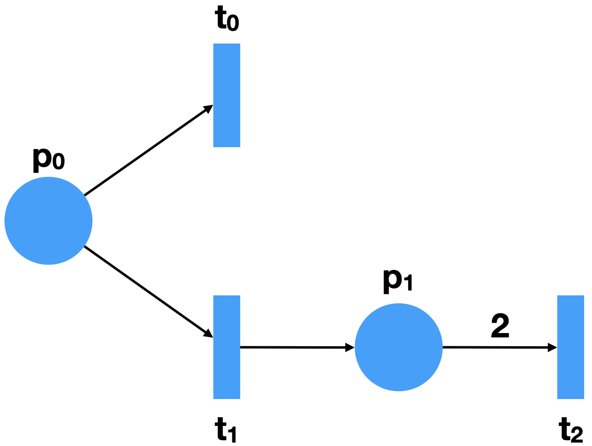

# Predicate Structure: CTL Model Checking on Parametric Petri nets

## TODO
- Pour améliorer le calcul par rapport à un marking, quand on calcule une longue chaine de formules CTL, pourquoi ne pas s'arrêter dès que le marking qu'on regarde appartient à la formule ?
- ADD net in SPS to compute not sps quand vide

This package aims at verifying CTL formulas on Petri nets with weighted arcs and potential capacity on places.
Unlike the usual technique where an initial marking is required, this is not the case here.
It can create the set of all markings that satisfy a CTL formula, using a symbolic representation called **Predicate structure**.
Furthermore, this structure allows to represent finite and infinite sets of markings.
This means that the number of markings can be unbounded.

The theory has been originally invented by Pascal Racloz & Didier Buchs [1].

## What are Predicate structures ?

A predicate structure is a couple `(a,b)`:
- `a` is a set of markings
- `b` is a set of markings

A marking `m` belongs to a predicate structure if all markings of `a` are included in `m` and all markings of `b` are not included in `m`.
Formally writing:
m ∈ (a,b) ⟺ ∀ m_a ∈ a, ∀ m_b ∈ b, m_a ⊆ m, m_b ⊈ m


Example of a Petri net:  
 

For example, the predicate structure that represents all markings such as `t2` is fireable is `({(0,2)}, {})`.
Thus, accepting markings are of the form `(0,x), x ∈ [2,∞)`.
If we want all markings such as `t2` is fireable but not `t0`, we get the following predicate structure: `({(0,2)}, {(1,0)})`.
It means that if there is at least one token in `p0`, the marking is not accepted.

For a set of predicate structures `sps`, a marking `m` belongs to it if there is at least one predicate structure `ps` such as `m ∈ ps`.

## What functionalities are available ?

- Create a Petri net / fire a transition.
- Create a set of predicate structures containing all markings that satisfy a CTL formula / return a set of predicate structures as a set of markings.
- Check if a marking satisfies a CTL formula.
- PNML parser, to import Petri nets from `pnml` file from a local source or a url.
- Query reduction for a CTL formula: From the paper in [2].

## CTL syntax

```Swift
// Basic cases:
- deadlock
- isFireable(Transition) // Transition = String
- after(Transition)
// Boolean logic
- true
- and(CTL, CTL)
- or(CTL, CTL)
- not(CTL)
// CTL operators
- EX(CTL)
- EF(CTL)
- EG(CTL)
- EU(CTL, CTL)
- AX(CTL)
- AF(CTL)
- AG(CTL)
- AU(CTL, CTL)
```

Example of some CTL formulas in Swift:
```Swift
CTL.EX(.isFireable("t0"))
CTL.EU(.and(.isFireable("t0"), .not(.isFireable("t1"))), .isFireable("t0"))
CTL.EF(.deadlock)
```

Thanks to Swift inference, we do not need to write `CTL.EX(CTL.isFireable("t0"))`.
We can reduce `CTL.isFireable` into `.isFireable`.
The same logic is applicable for each operators, except for the first one of the list.

## Use case examples

### Example 1

The below example, based on the previous Petri net, shows how to:
- Create a petri net
- Create CTL formulas
- Evaluate CTL formulas from a marking or without it.
- Get all the markings encoded by a set of predicate structures

```Swift
import PredicateStructure

// Same Petri net as before
let net = PetriNet(
  places: ["p0", "p1"],
  transitions: ["t0", "t1", "t2"],
  arcs: .pre(from: "p0", to: "t0", labeled: 1),
  .pre(from: "p0", to: "t1", labeled: 1),
  .post(from: "t1", to: "p1", labeled: 1),
  .pre(from: "p1", to: "t2", labeled: 2),
  capacity: ["p0": 4, "p1": 4] // Optional, can be removed
)

// Three examples of CTL formulas:
let ctlFormula1: CTL = .AX(.isFireable("t2"))
let ctlFormula2: CTL = .EF(.isFireable("t2"))
let ctlFormula3: CTL = .AF(.isFireable("t2"))

let marking = Marking(["p0": 2, "p1": 1], net: net)

// Check CTL formulas for a given marking:

// Return: false
print(ctlFormula1.eval(marking: marking, net: net))
// Return: true
print(ctlFormula2.eval(marking: marking, net: net))
// Return: false
print(ctlFormula3.eval(marking: marking, net: net))

// To obtain the sets of predicate structures that represent all markings:
let eval1 = ctlFormula1.eval(net: net)
// Return:
// {
//   ([], [[p1: 2, p0: 0], [p0: 1, p1: 0]]),
//   ([[p0: 0, p1: 4]], [])
// }
print(eval1)
// Return: [[p0: 0, p1: 0], [p0: 0, p1: 1], [p0: 0, p1: 4], [p0: 1, p1: 4], [p0: 2, p1: 4], [p0: 3, p1: 4], [p0: 4, p1: 4]]
print(eval1.underlyingMarkings())
// Return:
// {
//   ([[p1: 2, p0: 0]], []),
//   ([[p1: 0, p0: 2]], []),
//   ([[p1: 1, p0: 1]], [])
// }
print(ctlFormula2.eval(net: net))
// Return:
// {
//    ([[p1: 2, p0: 0]], [])
// }
print(ctlFormula3.eval(net: net))
```

For more examples, look at `Tests/PredicateStructureTests/CTLTests.swift` file.

The signatures of the `eval` function are the following:

If we want to check for a marking:
`eval(marking: Marking, net: PetriNet, rewrited: Bool = false, simplified: Bool = true) -> Bool`

If we want to obtain all markings:
`eval(net: PetriNet, rewrited: Bool = false, simplified: Bool = true) -> SPS`

Two parameters are optionals and can be changed if needed:
- rewrited: false by default. In CTL computation, the extended syntax is often computed using the rewriting into basic components. For example, `AX Φ ≡ ¬EX¬Φ`. When it is set to false, the extended syntax is not rewritten. In the case of `AX`, a specific function is dedicated to compute it.
- simplified: true by default. During a computation, the number of generated predicate structures may increase faster with redundant results. The simplification aims to reduce the set of predicate structures during the computation, using certain tricks. If it is set to true, no simplification is applied.

To get all the underlying markings of a set of predicate structures, you should use the function `underlyingMarkings`, which works on predicate structure and set of predicate structures.
Because a predicate structure can represent an infinite number of markings, the place capacity is used to bound the number of solutions.
The capacity is set by default to 20 for each place, but may be adapted as in the previous example with `capacity: ["p0": 4, "p1": 4]`.

### Example 2

The below example shows how to use the query reduction:

```swift
let ctl1 = CTL.not(.not(.true))

// Return: .true
print(ctl1.queryReduction())

let ctl2 = CTL.EF(.EF(.true))
// Return: .EF(.true)
print(ctl2.queryReduction())
```

All the reduction rules can be found in [2].

## How to import a pnml file ?

From a pnml file, we can extract the initial marking and the Petri net.

### From an URL:

```Swift
let parser = PnmlParser()
if let url = URL(string: "https://www.pnml.org/version-2009/examples/philo.pnml") {
  let (net, marking) = parser.loadPN(url: url)
}
```

### From a local file:

This is a bit tricky because of Swift.
You need to specify explicitly in the Swift package the folder where you will put your own pnml files. Follow the instructions below to include them:

- First, create a `Resources` folder at the same level of your `main.swift`.

- Then, modify your `Package.swift` to add the following line in `targets/executableTarget`:
`resources: [.process("Resources/")]`
It works the same way if you just have `target` instead of `executableTarget`:

Here is a complete example of the definition of a package:
```Swift
let package = Package(
    name: "Test",
    dependencies: [
        .package(url: "https://github.com/damdamo/PredicateStructure.git", .branch("main")),
    ],
    targets: [
        .executableTarget(
            name: "Test",
            dependencies: ["PredicateStructure"],
            resources: [.process("Resources/")]
        ),
        .testTarget(
            name: "TestTests",
            dependencies: ["Test"]),
    ]
)
```  

- Now, you can import your pnml file as follows:

```Swift
let parser = PnmlParser()
let (net, marking) = parser.loadPN(filePath: "nameOfYourFile.pnml")
```

For examples, look at the folder `Tests/PredicateStructureTests` and the file `ListExampleTests.swift`.

## References

[1] Racloz, P., & Buchs, D. (1994). Properties of Petri Nets Modellings: the temporal way. In 7th International Conference on Formal Description Techniques for Distributed Systems Communications Protocols. Services, Technologies.

[2] Bønneland, F., Dyhr, J., Jensen, P. G., Johannsen, M., & Srba, J. (2018). Simplification of CTL formulae for efficient model checking of Petri nets. In Application and Theory of Petri Nets and Concurrency: 39th International Conference, PETRI NETS 2018, Bratislava, Slovakia, June 24-29, 2018, Proceedings 39 (pp. 143-163). Springer International Publishing.
